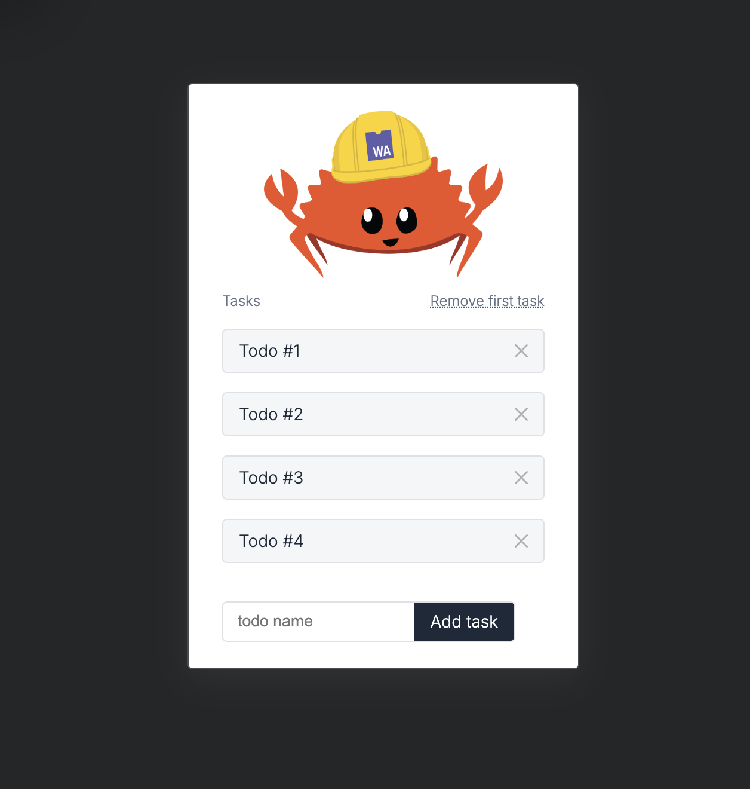

# 🦀🕸 Rust-WASM Todo List



## About

[**📚 Read this template tutorial! 📚**][template-docs]

This project is a simple Todo List application built using Rust and WebAssembly (WASM). It's one of the more unusual projects I've ever worked on, showcasing the power of Rust and WASM in a web application.

Be sure to check out [other `wasm-pack` tutorials online][tutorials] for other templates and usages of `wasm-pack`.

[tutorials]: https://rustwasm.github.io/docs/wasm-pack/tutorials/index.html
[template-docs]: https://rustwasm.github.io/docs/wasm-pack/tutorials/npm-browser-packages/index.html

## 📋 Table of Contents
- [🚴 Usage](#-usage)
  - [🐑 Clone this Template](#-use-cargo-generate-to-clone-this-template)
  - [🛠️ Build with `wasm-pack build`](#️-build-with-wasm-pack-build)
  - [🔬 Test in Headless Browsers](#-test-in-headless-browsers-with-wasm-pack-test)
  - [🎁 Publish to NPM](#-publish-to-npm-with-wasm-pack-publish)
- [🔋 Batteries Included](#-batteries-included)
- [📝 License](#-license)
- [🤝 Contribution](#-contribution)

## 🚴 Usage

### 🐑 Use `cargo generate` to Clone this Template

[Learn more about `cargo generate` here.](https://github.com/ashleygwilliams/cargo-generate)

```sh
cargo generate --git https://github.com/rustwasm/wasm-pack-template.git --name my-project
cd my-project
```

### 🛠️ Build with `wasm-pack build`

```sh
wasm-pack build
```

### 🔬 Test in Headless Browsers with `wasm-pack test`

```sh
wasm-pack test --headless --firefox
```

### 🎁 Publish to NPM with `wasm-pack publish`

```sh
wasm-pack publish
```

## 🔋 Batteries Included

* [`wasm-bindgen`](https://github.com/rustwasm/wasm-bindgen) for communicating between WebAssembly and JavaScript.
* [`console_error_panic_hook`](https://github.com/rustwasm/console_error_panic_hook) for logging panic messages to the developer console.
* `LICENSE-APACHE` and `LICENSE-MIT`: most Rust projects are licensed this way, so these are included for you.

## 📝 License

This project is licensed under either of

* Apache License, Version 2.0, ([LICENSE-APACHE](LICENSE-APACHE) or http://www.apache.org/licenses/LICENSE-2.0)
* MIT license ([LICENSE-MIT](LICENSE-MIT) or http://opensource.org/licenses/MIT)

at your option.

## 🤝 Contribution

Unless you explicitly state otherwise, any contribution intentionally submitted for inclusion in the work by you, as defined in the Apache-2.0 license, shall be dual licensed as above, without any additional terms or conditions.

---

This README provides a clear structure, helpful emojis, and all necessary information about the project, including sections for usage, building, testing, publishing, and contribution guidelines. It also includes placeholders for screenshots to visually represent your project.
